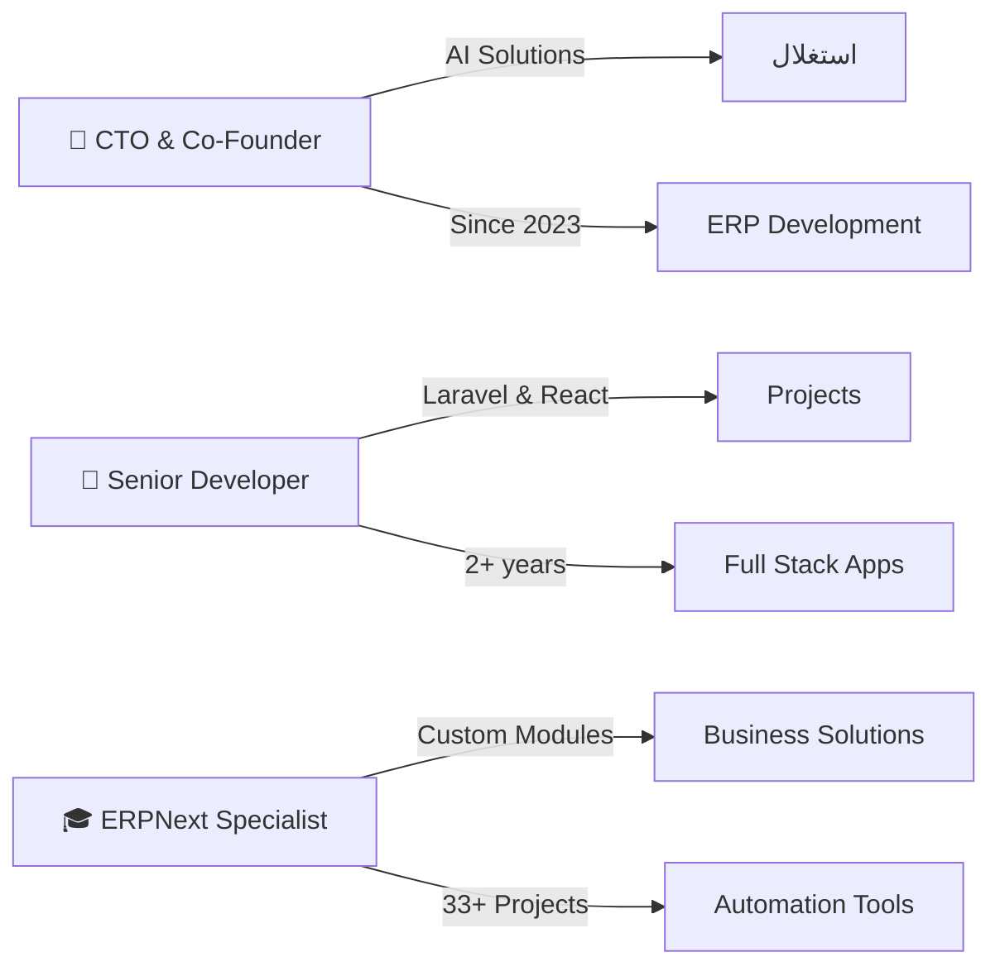

<div align="center">


<p align="center">
  
</p>

<p align="center">
  <a href="https://moh222salah.github.io/cv"></a>
  <a href="https://linkedin.com/in/mo222salah"></a>
  <a href="https://github.com/moh22salah"></a>
  <a href="https://wa.me/201113903070"></a>
</p>

---

### 👨‍💻 About Me

```javascript
const mohamedSalah = {
    role: "Full Stack Developer & ERP Specialist",
    location: "Egypt 🇪🇬",
    experience: "5+ years",
    specialization: ["ERPNext", "Laravel", "React", "AI Automation"],
    currentFocus: "Building intelligent ERP solutions",
    funFact: "I turn complex business workflows into elegant code ✨"
};
```

</div>

---

## 🚀 Tech Arsenal

<div align="center">

### 🎯 Core Technologies

<table>
<tr>
<td align="center" width="25%">

<br><strong>Python</strong>
<br><sub>ERPNext & Automation</sub>
</td>
<td align="center" width="25%">

<br><strong>PHP</strong>
<br><sub>Laravel & Backend</sub>
</td>
<td align="center" width="25%">

<br><strong>JavaScript</strong>
<br><sub>React & Node.js</sub>
</td>
<td align="center" width="25%">

<br><strong>React</strong>
<br><sub>Modern UI/UX</sub>
</td>
</tr>
</table>

### 🔧 Frameworks & Tools


### 💾 Databases & Cloud


</div>

---

## 💼 Experience Highlights

<div align="center">



</div>

<table>
<tr>
<td width="50%">

### 🎯 Professional Journey

- **🏢 CTO & Co-Founder** @ AI Solutions (2023 - Present)
  - Leading ERP implementation projects
  - Developing AI-powered automation systems
  - Managing development teams

- **💻 Senior Full Stack Developer** @ Freelance (2020 - Present)
  - 33+ successful projects delivered
  - Laravel, React, and ERPNext specialist
  - Custom business solutions architect

</td>
<td width="50%">

### 📊 Project Stats

```text
╭─────────────────────────────╮
│  📈 Projects Delivered: 33+ │
│  ⭐ Client Satisfaction: 5★ │
│  🎓 Certifications: AI & ERP│
│  🌍 Years Experience: 5+    │
╰─────────────────────────────╯
```

<p align="center">

</p>

</td>
</tr>
</table>

---

## 🎨 Featured Projects

<div align="center">

<table>
<tr>
<td width="50%">

### 🏪 ERPNext E-commerce Suite
*Complete ERP solution with integrated online store*

**Tech Stack:** ERPNext, Python, React  
**Features:**
- 🛒 Multi-vendor marketplace
- 📦 Inventory management
- 💳 Payment gateway integration
- 📊 Real-time analytics

[🔗 View Project](https://github.com/22salah)

</td>
<td width="50%">

### 🤖 AI Automation Platform
*Intelligent workflow automation system*

**Tech Stack:** Laravel, Python, AI/ML  
**Features:**
- 🧠 Smart document processing
- ⚡ Automated data entry
- 🔄 Multi-system integration
- 📈 Performance analytics

[🔗 View Project](https://github.com/22salah)

</td>
</tr>

<tr>
<td width="50%">

### 💼 HR Management System
*Complete employee lifecycle management*

**Tech Stack:** Frappe, ERPNext, React  
**Features:**
- 👥 Employee onboarding
- 📅 Leave management
- 💰 Payroll automation
- 📊 Performance tracking

[🔗 View Project](https://github.com/22salah)

</td>
<td width="50%">

### 🏗️ Construction Management App
*Real-time project tracking & resource allocation*

**Tech Stack:** Laravel, Vue.js, MySQL  
**Features:**
- 📐 Project planning
- 🚧 Resource management
- 💵 Budget tracking
- 📱 Mobile app integration

[🔗 View Project](https://github.com/22salah)

</td>
</tr>
</table>

<br>

> 🔥 **Want to see more?** Check out my [portfolio website](https://22salah.github.io) for a complete showcase of my work!

</div>

---

## 🎓 Certifications & Achievements

<div align="center">

| 🏆 Certification | 🏢 Issuer | 📅 Year |
|:----------------|:----------|:--------|
| ✅ Excel Spreadsheets | Edraak - ICDL | 2026 |
| ✅ ERPNext Implementation | Frappe Technologies | 2024 |
| ✅ AI & Machine Learning | Multiple Platforms | 2024 |
| ✅ Full Stack Development | Professional Training | 2023 |
| ✅ Laravel Advanced Concepts | Udemy | 2023 |

</div>

---

## 📫 Let's Connect

<div align="center">


### 💬 Get In Touch

**I'm always excited to collaborate on innovative projects!**

<p>
<a href="mailto:mohamed@example.com">
  
</a>
<a href="https://wa.me/201113903070">
  
</a>
<a href="https://linkedin.com/in/22salah">
  
</a>
<a href="https://github.com/22salah">
  
</a>
</p>

### 🌟 Currently Available For

- 🔹 ERP Implementation & Customization
- 🔹 Full Stack Web Development
- 🔹 AI Automation Solutions
- 🔹 Technical Consulting
- 🔹 Code Review & Mentoring

---

<details>
<summary>📊 <b>GitHub Activity Graph</b></summary>
<br/>


</details>

<details>
<summary>🏆 <b>GitHub Trophies</b></summary>
<br/>


</details>

---


<p align="center">
  
</p>

<p align="center">
  <sub>⚡ Crafted with passion by Mohamed Salah | © 2024 All Rights Reserved</sub>
</p>

</div>
